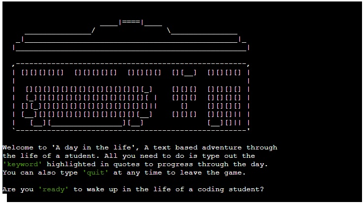

# A Day In The Life

## A day in the life is a text adventure which allows the player to experience a day in the life of a full stack software development student. It has two main forks following a good day or a bad day, both of which have successful and unsuccessful endings. The user is given select keywords to progress to the next node which are highlighted in green.

#### Live Site [Here](https://a-day-in-the-life-ae933bba8572.herokuapp.com/)

#### How to play
- Keywords are highlighted using a green colour and are contained in single quotes.
- Enter one of the highlighted keywords from the text to continue in the story.
- To begin playing the user must type the 'ready' keyword.
- You can quit at any time using the 'quit' keyword.
- After entering a keyword you progress to the next node, or reach a dead end.
- After reaching a successful or unsuccessful ending you are asked if you would like to try again.

## Features
- Upon running the game you are greeted with a picture of a keyboard and screen is ASCII art format.  
 

- All 3 options are working answers and have small custom messages, and once 'ready' is entered the game will begin. Other responses will give the user feeedback to provide a different answer. 
 

- Once 'ready' is entered the game will begin and the story starts. 
 

- All inputs are checked and feedback is given to the player incase of mistakes.  
 

- All notes and comments in the run.py file follow the projects map which is provided in both the assets file as well as below. The 'good day' path is on the right side of the map, and the 'bad day' path is taken through the left side. 
 

- The left side of the map is viewed as a bad day and the right side as a good day. Both sides have the same amount of dead ends as well as both having successful game endings.

## Technologies used

1. Python
2. Colorama extension
3. Replit IDE
4. Code Institute Python Linter

## Frameworks, Deployement & Libraries

* [Github](https://github.com/)

* [CodeAnywhere](https://app.codeanywhere.com/)

* [Replit](https://replit.com/~)

## Testing

* Testing was carried out constantly in the terminal as well as using Replit to test fixes quickly.
* User input was tested in every node of the project to make sure the path was followed, this is ensured through while loops.
* User input is also checked in every node to allow a user to quit at any time.
* After deployment text was modified to fit the 80 character wide window since hidden text is included in CI Linters character counter.

## Accessibility

* The project is 500+ lines of code. This is because there are 12 different nodes and 15 possible end points.
* This leads to there being large amounts of print statements and lots of text.

## Issues and bugs

* None.

## Fixed bugs

* After deployment there were dozens of new line errors and formatting issues.
 - These were fixed one by one going through the app and running the program again in Replit to make sure the problem was solved.
* Colorama would not add to requirements through terminal so the file was modified manually.
* Indentation and white space errors were caught by CI Linter and corrected.
* Game over function was created to allow easy escape from nested while loops.

## Validator Testing
The project was ran through  
 

## Deployment

This project was deployed using Code Institute's Heroku terminal.

- Clone this repository.
- Create a new Heroku app.
- When you create the app, you will need to add two buildpacks from the _Settings_ tab.
1. `heroku/python`
2. `heroku/nodejs`
- Link the Heroku app to the repository.
- Click Deploy.

## Credits
https://www.ascii.co.uk/art/ was used for inspiration for the keyboard image.
